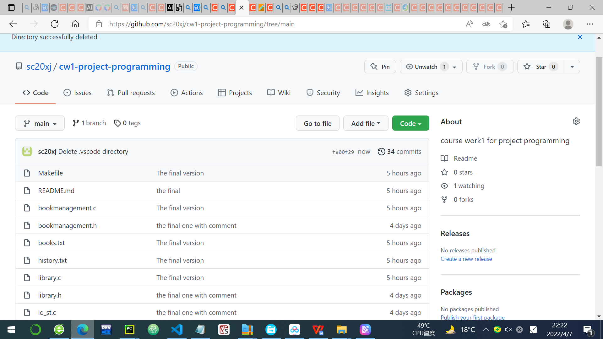
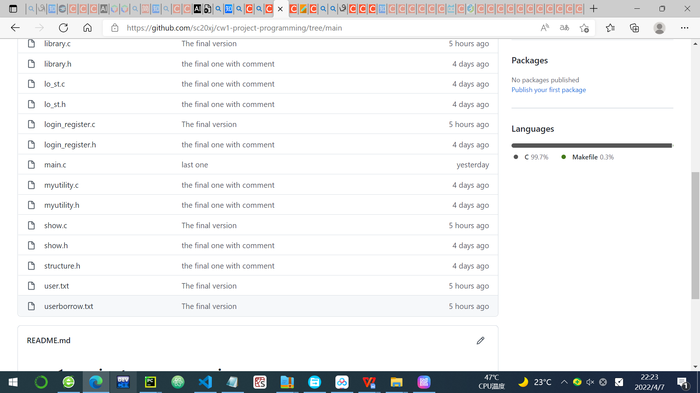

# cw1-project-programming
course work1 for project programming

This is the coursework1 library system of Xiangtian Ji 
student id:2020110056
leeds id:201487491

The project consists:
library.c library.h: the functions that connect the other function together
lo_st.c lo_st.h:The functions that for store and load data
myutility.c myutility.h:The functions of input function and examination of input
show.h show.h:Containing the function of display different kinds of information of users or books.
bookmanagement.c bookmanagement.h:The functions of operation of books such as remove,add,return,borrow,find by title,find by author,find by year 

books.txt:the data of books
user.txt:the data of users
history.txt: the history of the book borrowing
userborrow.txt:the data of user's current borrowing

The whole system realize the basic function of book operation and login,register functions that was asked. It also can store the book history of borrowing additionally.

URL of git repository:https://github.com/sc20xj/cw1-project-programming

